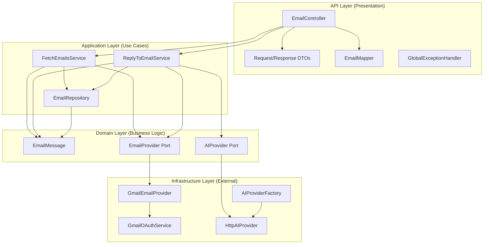
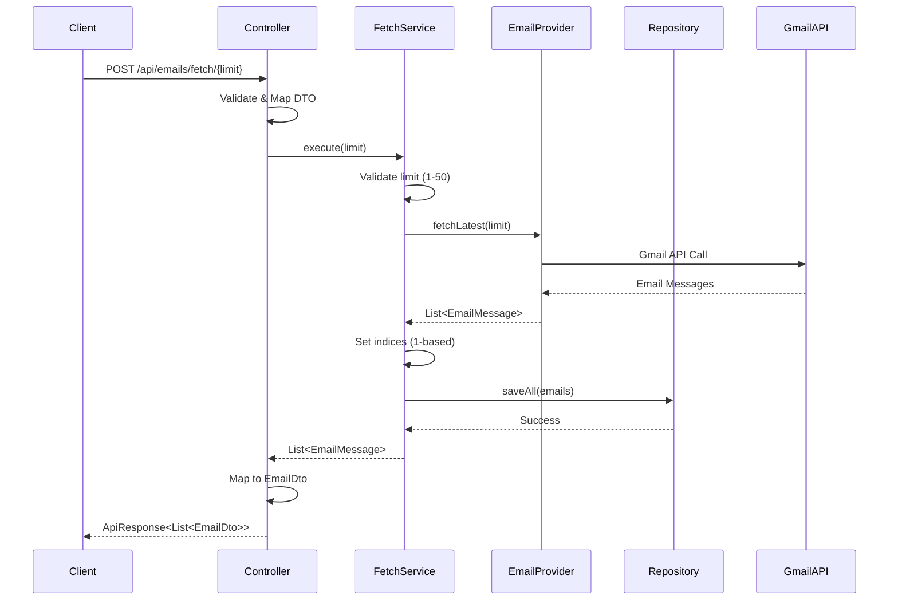
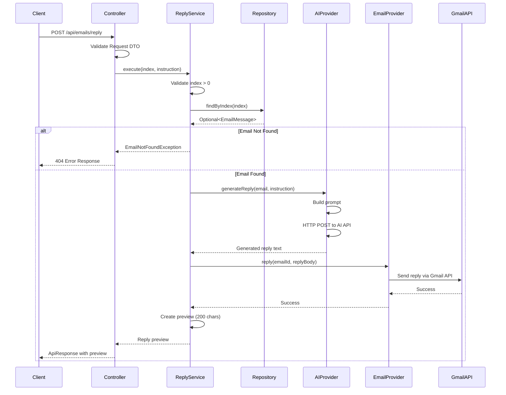

# Email Assistant API

A Spring Boot application that provides a RESTful API for managing emails using Gmail with OAuth2 authentication and AI-powered responses. Built with clean architecture principles for maintainability and extensibility.

## Table of Contents

- [Architecture](#architecture)
- [Application Flow](#application-flow)
- [Prerequisites & Setup](#prerequisites--setup)
- [Google Console Onboarding](#google-console-onboarding)
- [Local AI Setup (Ollama)](#local-ai-setup-ollama)
- [API Endpoints](#api-endpoints)
- [Configuration](#configuration)
- [Technologies](#technologies)

## Architecture

The application follows **Clean Architecture** principles with clear separation of concerns across four layers:

### Architecture Diagram



### Package Structure

```
com.ai.emailassistant/
├── api/                    # Presentation Layer
│   ├── controller/         # REST Controllers
│   ├── dto/                # Request/Response DTOs
│   ├── mapper/             # Domain ↔ DTO Mappers
│   └── exception/          # Exception Handlers
│
├── application/            # Application Layer
│   ├── service/            # Use Case Services
│   └── repository/         # Repository Interfaces & Implementations
│
├── domain/                 # Domain Layer
│   ├── model/              # Domain Entities
│   └── port/               # Port Interfaces (Contracts)
│
├── infrastructure/         # Infrastructure Layer
│   ├── email/              # Email Provider Implementations
│   │   └── gmail/          # Gmail-specific implementation
│   └── ai/                 # AI Provider Implementations
│       ├── http/           # HTTP-based AI provider
│       └── config/         # Provider configurations
│
├── common/                 # Shared Constants
├── config/                 # Application Configuration
└── exception/              # Domain Exceptions
```

### Layer Responsibilities

- **API Layer**: Handles HTTP requests/responses, validation, DTO mapping
- **Application Layer**: Orchestrates use cases, business workflows
- **Domain Layer**: Core business entities and contracts (ports)
- **Infrastructure Layer**: External service implementations (adapters)

## Application Flow

### Fetch Emails Flow



### Reply to Email Flow



## Prerequisites & Setup

### Prerequisites

- **JDK 17+** (Java Development Kit)
- **Maven 3.6+** (Build tool)
- **Google Cloud Account** (for Gmail API access)
- **AI Provider** (Ollama for local, or any HTTP-based AI API)

### Step 1: Clone and Build

```bash
git clone <repository-url>
cd Email-Assistant
mvn clean install
```

### Step 2: Google Console Onboarding

Follow the detailed steps in [Google Console Onboarding](#google-console-onboarding) section below.

### Step 3: Setup Local AI (Ollama)

Follow the steps in [Local AI Setup (Ollama)](#local-ai-setup-ollama) section below.

### Step 4: Configure Environment Variables

Create a `.env` file in the project root:

```bash
# Gmail Configuration
GMAIL_EMAIL=your-email@gmail.com
GMAIL_CLIENT_ID=your-client-id.apps.googleusercontent.com
GMAIL_CLIENT_SECRET=your-client-secret

# AI Configuration (Ollama)
AI_API_URL=http://localhost:11434/api/generate
AI_MODEL_NAME=mistral
AI_AUTH_HEADER=
AI_AUTH_PREFIX=

# Optional: Custom timeouts
AI_CONNECT_TIMEOUT=10000
AI_READ_TIMEOUT=60000
```

### Step 5: Place Gmail Credentials

1. Download `credentials.json` from Google Cloud Console (see onboarding steps)
2. Place it in the project root directory:
   ```
   Email-Assistant/
   ├── credentials.json  ← Place here
   ├── pom.xml
   └── src/
   ```

### Step 6: Run the Application

```bash
# Using Maven
mvn spring-boot:run

# Or using the JAR
java -jar target/Email-Assistant-0.0.1-SNAPSHOT.jar
```

The application will start on `http://localhost:8080`

## Google Console Onboarding

### Step 1: Create a Google Cloud Project

1. Go to [Google Cloud Console](https://console.cloud.google.com/)
2. Click on the project dropdown at the top
3. Click **"New Project"**
4. Enter project name: `Email Assistant` (or any name)
5. Click **"Create"**
6. Wait for project creation and select it

### Step 2: Enable Gmail API

1. In the Google Cloud Console, navigate to **"APIs & Services"** > **"Library"**
2. Search for **"Gmail API"**
3. Click on **"Gmail API"** from the results
4. Click **"Enable"** button
5. Wait for the API to be enabled

### Step 3: Configure OAuth Consent Screen

1. Navigate to **"APIs & Services"** > **"OAuth consent screen"**
2. Select **"External"** user type (unless you have Google Workspace)
3. Click **"Create"**
4. Fill in the required information:
   - **App name**: `Email Assistant`
   - **User support email**: Your email address
   - **Developer contact information**: Your email address
5. Click **"Save and Continue"**
6. On **"Scopes"** page:
   - Click **"Add or Remove Scopes"**
   - Select the following scopes:
     - `https://www.googleapis.com/auth/gmail.readonly`
     - `https://www.googleapis.com/auth/gmail.send`
   - Click **"Update"** then **"Save and Continue"**
7. On **"Test users"** page:
   - Click **"Add Users"**
   - Add your Gmail address
   - Click **"Add"** then **"Save and Continue"**
8. Review and click **"Back to Dashboard"**

### Step 4: Create OAuth 2.0 Credentials

1. Navigate to **"APIs & Services"** > **"Credentials"**
2. Click **"+ CREATE CREDENTIALS"** at the top
3. Select **"OAuth client ID"**
4. If prompted, select **"Desktop app"** as the application type
5. Fill in:
   - **Name**: `Email Assistant Client`
   - **Application type**: **Desktop app**
6. Click **"Create"**
7. A popup will appear with your credentials:
   - **Client ID**: Copy this value
   - **Client Secret**: Copy this value
8. Click **"OK"**

### Step 5: Download Credentials File

1. In the **"Credentials"** page, find your OAuth 2.0 Client ID
2. Click the **download icon** (⬇️) next to your client
3. The file will be named something like `client_secret_xxxxx.apps.googleusercontent.com.json`
4. **Rename** this file to `credentials.json`
5. **Move** it to your project root directory

### Step 6: Configure Environment Variables

Add the credentials to your `.env` file:

```bash
GMAIL_EMAIL=your-email@gmail.com
GMAIL_CLIENT_ID=xxxxx.apps.googleusercontent.com
GMAIL_CLIENT_SECRET=your-client-secret-here
```

### First Run Authentication

When you run the application for the first time:

1. The application will open a browser window
2. Sign in with your Google account (the one you added as a test user)
3. Click **"Allow"** to grant permissions
4. The OAuth token will be saved in the `tokens/` directory
5. Subsequent runs won't require re-authentication (until token expires)

## Local AI Setup (Ollama)

### Step 1: Install Ollama

**macOS:**
```bash
brew install ollama
# Or download from https://ollama.ai/download
```

**Linux:**
```bash
curl -fsSL https://ollama.ai/install.sh | sh
```

**Windows:**
Download installer from [https://ollama.ai/download](https://ollama.ai/download)

### Step 2: Start Ollama Service

```bash
ollama serve
```

This starts Ollama on `http://localhost:11434`

### Step 3: Download a Model

```bash
# Download Mistral (recommended, ~4GB)
ollama pull mistral

# Or download other models:
ollama pull llama2
ollama pull codellama
```

### Step 4: Test Ollama API

```bash
curl http://localhost:11434/api/generate -d '{
  "model": "mistral",
  "prompt": "Hello, how are you?",
  "stream": false
}'
```

You should get a JSON response with the generated text.

### Step 5: Configure Application

Add to your `.env` file:

```bash
AI_API_URL=http://localhost:11434/api/generate
AI_MODEL_NAME=mistral
AI_AUTH_HEADER=
AI_AUTH_PREFIX=
```

**Note:** Ollama doesn't require authentication, so leave `AI_AUTH_HEADER` and `AI_AUTH_PREFIX` empty.

### Alternative: Using Other AI Providers

The application supports any HTTP-based AI API. Configure accordingly:

```bash
# Example: OpenAI
AI_API_URL=https://api.openai.com/v1/chat/completions
AI_API_KEY=sk-xxxxx
AI_AUTH_HEADER=Authorization
AI_AUTH_PREFIX=Bearer
AI_MODEL_NAME=gpt-4

# Example: Custom API
AI_API_URL=https://your-ai-api.com/generate
AI_API_KEY=your-api-key
AI_AUTH_HEADER=X-API-Key
AI_AUTH_PREFIX=
```

## API Endpoints

### Base URL

```
http://localhost:8080/api/emails
```

### 1. Fetch Emails

Fetch the most recent emails from your Gmail inbox.

**Endpoint:** `POST /api/emails/fetch/{limit}`

**Path Parameters:**
- `limit` (integer): Number of emails to fetch (1-50). Defaults to 10 if 0 or negative.

**Request Example:**
```bash
curl -X POST http://localhost:8080/api/emails/fetch/5
```

**Response Example:**
```json
{
  "success": true,
  "message": "Successfully fetched emails",
  "data": [
    {
      "index": 1,
      "emailId": "19bdd0564822fc92",
      "from": "Tripadvisor <savings@mp1.tripadvisor.com>",
      "subject": "Score great rates for your next big trip",
      "snippet": "Hotels and experiences—we've got it all...",
      "receivedAt": "2026-01-20T18:24:56Z"
    },
    {
      "index": 2,
      "emailId": "19bdca71dfd64010",
      "from": "AllTrails <no-reply@email.alltrails.com>",
      "subject": "Sale ends in three, two...",
      "snippet": "Final hours to get 50% off ⏳...",
      "receivedAt": "2026-01-20T20:07:55Z"
    }
  ]
}
```

**Error Response:**
```json
{
  "success": false,
  "message": "Validation Failed",
  "error": "Limit must be between 1 and 50",
  "status": 400
}
```

### 2. Reply to Email

Generate and send an AI-powered reply to a selected email.

**Endpoint:** `POST /api/emails/reply`

**Request Body:**
```json
{
  "index": 2,
  "userInstruction": "Reply professionally thanking them for their message and letting me know about new offers"
}
```

**Request Fields:**
- `index` (integer, required): 1-based index of the email from the last fetch (must be ≥ 1)
- `userInstruction` (string, optional): Custom instruction for the AI reply generation

**Request Example:**
```bash
curl -X POST http://localhost:8080/api/emails/reply \
  -H "Content-Type: application/json" \
  -d '{
    "index": 2,
    "userInstruction": "Reply professionally thanking them for their message"
  }'
```

**Response Example:**
```json
{
  "success": true,
  "message": "Reply sent successfully",
  "data": {
    "index": 2,
    "replyPreview": "Thank you for reaching out regarding the new offers. I appreciate you taking the time to share this information with me. I'm interested in learning more about the details..."
  }
}
```

**Error Responses:**

**Email Not Found:**
```json
{
  "success": false,
  "message": "Email Not Found",
  "error": "Email not found at index: 99",
  "status": 404
}
```

**Validation Error:**
```json
{
  "success": false,
  "message": "Validation Failed",
  "error": "index: Index must be greater than 0",
  "status": 400
}
```

**AI Provider Error:**
```json
{
  "success": false,
  "message": "Provider Error",
  "error": "Failed to connect to AI provider: http://localhost:11434/api/generate",
  "status": 503
}
```

## Configuration

### Environment Variables

| Variable | Description | Required | Default |
|----------|-------------|----------|---------|
| `GMAIL_EMAIL` | Your Gmail address | Yes | - |
| `GMAIL_CLIENT_ID` | OAuth 2.0 Client ID | Yes | - |
| `GMAIL_CLIENT_SECRET` | OAuth 2.0 Client Secret | Yes | - |
| `AI_API_URL` | AI provider API endpoint | Yes | - |
| `AI_MODEL_NAME` | AI model name | No | `mistral` |
| `AI_API_KEY` | API key for authentication | No | - |
| `AI_AUTH_HEADER` | Header name for auth | No* | - |
| `AI_AUTH_PREFIX` | Auth prefix (e.g., "Bearer") | No | - |
| `AI_CONNECT_TIMEOUT` | Connection timeout (ms) | No | `10000` |
| `AI_READ_TIMEOUT` | Read timeout (ms) | No | `60000` |

*Required if `AI_API_KEY` is set

### Application Properties

The application uses `application.yml` for configuration. Most values are loaded from environment variables. See `src/main/resources/application.yml` for the full configuration structure.

## Technologies

- **Java 17+** - Programming language
- **Spring Boot 3.4.3** - Application framework
- **Spring Web** - REST API support
- **Spring Validation** - Request validation
- **Gmail API** - Email integration
- **OAuth2** - Gmail authentication
- **Lombok** - Boilerplate reduction
- **Jackson** - JSON processing
- **Maven** - Build tool

## Features

- ✅ **Clean Architecture** - Layered architecture with clear separation of concerns
- ✅ **Gmail Integration** - OAuth2-based secure Gmail access
- ✅ **AI-Powered Replies** - Configurable AI provider for intelligent email responses
- ✅ **Repository Pattern** - Thread-safe in-memory email caching
- ✅ **Factory Pattern** - Easy AI provider swapping via configuration
- ✅ **Type-Safe Configuration** - `@ConfigurationProperties` for all settings
- ✅ **Comprehensive Error Handling** - Global exception handler with proper HTTP status codes
- ✅ **Validation** - Bean validation on all request DTOs
- ✅ **CORS Support** - Pre-configured for UI integration
- ✅ **Constants Management** - Centralized constants for maintainability
- ✅ **Lombok Integration** - Reduced boilerplate code

## Development

### Running Tests

```bash
mvn test
```

### Building

```bash
mvn clean package
```

### Code Style

- 4 spaces indentation
- UpperCamelCase for classes
- lowerCamelCase for methods/fields
- SCREAMING_SNAKE_CASE for constants

## License

This project is licensed under the MIT License.
