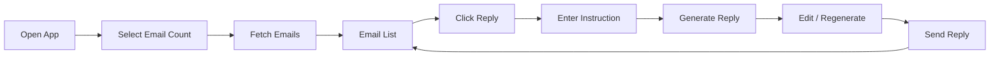
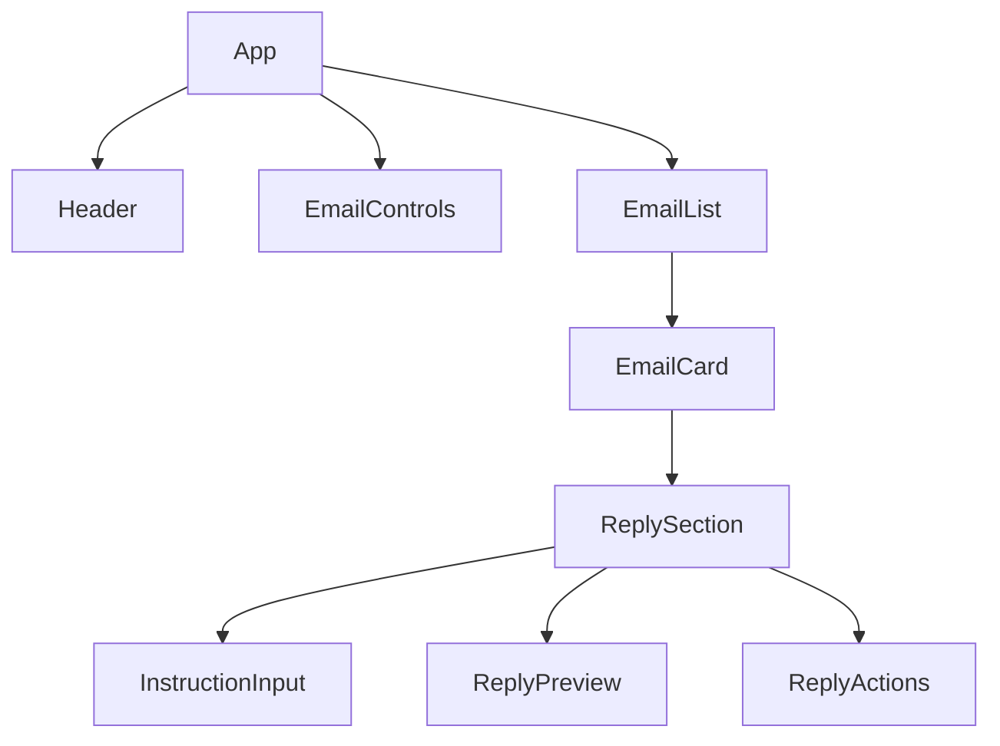

# Email Assistant – Frontend Wireframes & UI Inspiration

This document contains **wireframes (ASCII + Mermaid)** and **UI inspiration ideas** aligned with your implementation plan. It is intentionally framework-agnostic at the design level and maps cleanly to your React + Tailwind setup.

---

## 1. User Flow (High-Level)

**Fetch → Browse → Reply → Iterate → Send**



---

## 2. Main Email List View – Wireframe (Refined)

**Desktop Layout (1440px+):**
```
┌────────────────────────────────────────────────────────────────────────────┐
│  Header (Sticky, bg-white, border-b border-slate-200)                    │
│  ┌──────────────────────────────────────────────────────────────────────┐ │
│  │  ✉️ Email Assistant                    [15 ▼]  [Fetch Emails]      │ │
│  │  (text-2xl font-semibold text-slate-900)  (select)    (button)     │ │
│  └──────────────────────────────────────────────────────────────────────┘ │
├────────────────────────────────────────────────────────────────────────────┤
│  Email List Container (max-w-4xl mx-auto px-6 py-4)                      │
│  ┌──────────────────────────────────────────────────────────────────────┐ │
│  │  Email Card 1 (bg-white border border-slate-200 rounded-lg p-4)      │ │
│  │  ┌──────────────────────────────────────────────────────────────┐  │ │
│  │  │ From: John Doe <john@gmail.com>    [Jan 20, 10:32 AM]         │  │ │
│  │  │ (text-sm font-medium text-slate-900)  (text-xs text-slate-500)│  │ │
│  │  │                                                               │  │ │
│  │  │ Subject: Meeting Follow-up                                    │  │ │
│  │  │ (text-base font-semibold text-slate-800)                     │  │ │
│  │  │                                                               │  │ │
│  │  │ Preview: Hey, just wanted to follow up on our discussion...  │  │ │
│  │  │ (text-sm text-slate-600 line-clamp-2)                         │  │ │
│  │  │                                                               │  │ │
│  │  │                                    [ Reply → ]                │  │ │
│  │  │                                    (text-indigo-600 hover)    │  │ │
│  │  └──────────────────────────────────────────────────────────────┘  │ │
│  │  (hover:shadow-md transition-shadow duration-200)                   │ │
│  └──────────────────────────────────────────────────────────────────────┘ │
│                                                                           │
│  ┌──────────────────────────────────────────────────────────────────────┐ │
│  │  Email Card 2 (same styling)                                        │ │
│  └──────────────────────────────────────────────────────────────────────┘ │
│  (Scrollable, gap-4)                                                      │
└────────────────────────────────────────────────────────────────────────────┘
```

**Design Specifications:**
- **Header**: Sticky positioning, white background (`bg-white`), subtle bottom border (`border-b border-slate-200`)
- **Email Cards**: White background, 1px border (`border border-slate-200`), rounded corners (`rounded-lg`), padding (`p-4`)
- **Hover Effect**: Soft shadow on hover (`hover:shadow-md transition-shadow duration-200`)
- **Spacing**: Consistent padding (`p-4`), gap between cards (`gap-4`)
- **Typography Hierarchy**: 
  - Header: `text-2xl font-semibold`
  - Subject: `text-base font-semibold text-slate-800`
  - From: `text-sm font-medium text-slate-900`
  - Preview: `text-sm text-slate-600 line-clamp-2`
  - Timestamp: `text-xs text-slate-500`
- **Layout**: Centered container (`max-w-4xl mx-auto`) for optimal readability
- **Cards**: Clickable/focusable with keyboard navigation support

---

## 3. Email Card – Expanded with Inline Reply (All States)

### State 1: Collapsed (Default)
```
┌────────────────────────────────────────────────────────────────────────────┐
│  Email Card (expanded)                                                    │
│  ┌──────────────────────────────────────────────────────────────────────┐ │
│  │ From: John Doe <john@gmail.com>    [Jan 20, 10:32 AM]              │ │
│  │ Subject: Meeting Follow-up                                          │ │
│  │                                                                      │ │
│  │ Preview: Hey, just wanted to follow up...                          │ │
│  │                                                                      │ │
│  │ [ Reply → ]                                                         │ │
│  └──────────────────────────────────────────────────────────────────────┘ │
└────────────────────────────────────────────────────────────────────────────┘
```

### State 2: Expanded - Empty (Reply clicked, no instruction yet)
```
┌────────────────────────────────────────────────────────────────────────────┐
│  Email Card (expanded)                                                    │
│  ┌──────────────────────────────────────────────────────────────────────┐ │
│  │ From: John Doe <john@gmail.com>    [Jan 20, 10:32 AM]              │ │
│  │ Subject: Meeting Follow-up                                          │ │
│  │                                                                      │ │
│  │ Preview: Hey, just wanted to follow up...                          │ │
│  │                                                                      │ │
│  │ [ Reply → ] (active)                                                 │ │
│  ├──────────────────────────────────────────────────────────────────────┤ │
│  │  Reply Assistant                                                     │ │
│  │  (bg-indigo-50 border-l-4 border-indigo-500 rounded-r-lg p-4)       │ │
│  │                                                                      │ │
│  │  Instruction (optional)                                              │ │
│  │  ┌──────────────────────────────────────────────────────────────┐  │ │
│  │  │ Write a polite follow-up confirming next steps...             │  │ │
│  │  │ (textarea, min-h-20, border-slate-300 focus:border-indigo-500) │  │ │
│  │  └──────────────────────────────────────────────────────────────┘  │ │
│  │                                                                      │ │
│  │  [ Generate Reply ]                                                  │ │
│  │  (bg-indigo-600 text-white hover:bg-indigo-700)                    │ │
│  │                                                                      │ │
│  │  [ Cancel ]                                                         │ │
│  │  (text-slate-600 hover:text-slate-800)                              │ │
│  └──────────────────────────────────────────────────────────────────────┘ │
└────────────────────────────────────────────────────────────────────────────┘
```

### State 3: Generating (Loading)
```
│  ┌──────────────────────────────────────────────────────────────────────┐ │
│  │  Reply Assistant (loading state)                                     │ │
│  │                                                                      │ │
│  │  Instruction: [filled text]                                          │ │
│  │  (disabled, bg-slate-50)                                             │ │
│  │                                                                      │ │
│  │  [ ⏳ Generating... ]                                                │ │
│  │  (disabled, bg-indigo-400 cursor-not-allowed)                        │ │
│  │                                                                      │ │
│  │  [ Cancel ] (disabled)                                                │ │
│  └──────────────────────────────────────────────────────────────────────┘ │
```

### State 4: Generated (Success)
```
│  ┌──────────────────────────────────────────────────────────────────────┐ │
│  │  Reply Assistant                                                     │ │
│  │                                                                      │ │
│  │  Instruction: [filled text]                                          │ │
│  │  (read-only, bg-slate-50 text-slate-600)                             │ │
│  │                                                                      │ │
│  │  Generated Reply ✨                                                  │ │
│  │  ┌──────────────────────────────────────────────────────────────┐  │ │
│  │  │ Hi John,                                                      │  │ │
│  │  │                                                               │  │ │
│  │  │ Thanks for following up. I really enjoyed our conversation   │  │ │
│  │  │ and look forward to the next steps...                        │  │ │
│  │  │                                                               │  │ │
│  │  │ Best regards,                                                 │  │ │
│  │  │ [Your Name]                                                   │  │ │
│  │  │ (textarea, bg-white border border-slate-300, editable)        │  │ │
│  │  └──────────────────────────────────────────────────────────────┘  │ │
│  │                                                                      │ │
│  │  [ Regenerate ] [ Edit ] [ Send Reply ] [ Cancel ]                 │ │
│  │  (secondary)  (secondary) (primary)    (text)                       │ │
│  └──────────────────────────────────────────────────────────────────────┘ │
```

### State 5: Editing (Manual Edit Mode)
```
│  │  Generated Reply (Editing)                                            │ │
│  │  ┌──────────────────────────────────────────────────────────────┐  │ │
│  │  │ [User is typing...]                                           │  │ │
│  │  │ (textarea, focus ring-indigo-500, border-indigo-500)          │  │ │
│  │  └──────────────────────────────────────────────────────────────┘  │ │
│  │                                                                      │ │
│  │  [ Regenerate ] [ Save Changes ] [ Send Reply ] [ Cancel ]         │ │
│  │  (secondary)  (primary)         (primary)    (text)               │ │
```

### State 6: Sending
```
│  │  [ ⏳ Sending... ]                                                   │ │
│  │  (disabled, bg-emerald-400)                                         │ │
│  │  [ Cancel ] (disabled)                                               │ │
```

### State 7: Error
```
│  │  ⚠️ Failed to generate reply. Please try again.                     │ │
│  │  (text-rose-600 bg-rose-50 border border-rose-200 rounded p-3)      │ │
│  │  [ Retry ] [ Cancel ]                                               │ │
```

**Reply Section Design Specifications:**
- **Background**: Light indigo tint (`bg-indigo-50`)
- **Left Border Accent**: 4px indigo border (`border-l-4 border-indigo-500`)
- **Padding**: `p-4` (16px)
- **Border Radius**: Rounded on right side only (`rounded-r-lg`)
- **Animation**: Smooth expand/collapse (`transition-all duration-300 ease-out`)
- **Textarea**: Minimum height `min-h-20`, focus border color `border-indigo-500`

---

## 4. Mobile Wireframe (Responsive - 375px to 768px)

```
┌──────────────────────────────┐
│  Header (sticky)             │
│  ┌────────────────────────┐ │
│  │ ✉️ Email Assistant     │ │
│  │ (text-xl font-semibold) │ │
│  │                        │ │
│  │ [15 ▼]  [Fetch]        │ │
│  │ (full-width buttons,   │ │
│  │  gap-2, mb-4)          │ │
│  └────────────────────────┘ │
├──────────────────────────────┤
│  Email List (scrollable)     │
│  ┌────────────────────────┐ │
│  │ John Doe               │ │
│  │ (text-sm font-medium)  │ │
│  │                        │ │
│  │ Meeting Follow-up      │ │
│  │ (text-base font-semibold)│ │
│  │                        │ │
│  │ Jan 20, 10:32 AM      │ │
│  │ (text-xs text-slate-500)│ │
│  │                        │ │
│  │ Preview text...        │ │
│  │ (text-sm line-clamp-2)  │ │
│  │                        │ │
│  │ [ Reply ]              │ │
│  │ (full-width button,    │ │
│  │  w-full mt-2)           │ │
│  └────────────────────────┘ │
│                              │
│  ┌────────────────────────┐ │
│  │ Reply Assistant        │ │
│  │ (accordion, slides in  │ │
│  │  from bottom,          │ │
│  │  transition-all)       │ │
│  │                        │ │
│  │ Instruction:           │ │
│  │ [textarea]             │ │
│  │ (min-h-24, w-full)     │ │
│  │                        │ │
│  │ [ Generate ]           │ │
│  │ (w-full, mb-2)          │ │
│  │                        │ │
│  │ Generated Reply:       │ │
│  │ [textarea]             │ │
│  │ (min-h-32, w-full)      │ │
│  │                        │ │
│  │ [Regenerate]           │ │
│  │ [Edit]                 │ │
│  │ [Send]                 │ │
│  │ [Cancel]               │ │
│  │ (stacked vertically,    │ │
│  │  w-full, gap-2)         │ │
│  └────────────────────────┘ │
└──────────────────────────────┘
```

**Mobile Design Specifications:**
- **Layout**: Stacked vertically, full-width components
- **Header**: Compact, sticky positioning
- **Buttons**: Full-width (`w-full`) with consistent spacing (`gap-2`)
- **Reply Section**: Accordion-style panel that slides in from bottom
- **Typography**: Slightly smaller font sizes for mobile
- **Spacing**: Reduced padding (`p-3` instead of `p-4`)
- **Touch Targets**: Minimum 44px height for buttons (accessibility)

---

## 5. Component Hierarchy (Mapping to Code)



---

## 6. UI Inspiration Ideas (Fresh & Modern)

### 🔹 1. “Gmail × Notion” Hybrid
- Clean white background
- Subtle card borders
- Soft shadows only on hover
- Mono-spaced preview for AI replies

**Why:** Familiar + professional

---

### 🔹 2. Timeline-Based Inbox
- Emails stacked like a vertical timeline
- Timestamp dot on left
- Reply section slides in from bottom

**Why:** Great storytelling UX

---

### 🔹 3. AI-First Reply Experience
- Reply section visually distinct (soft purple/blue gradient)
- AI-generated text highlighted subtly
- Inline “✨ AI Suggestion” badge

**Why:** Makes AI feel intentional, not hidden

---

### 🔹 4. Command-Style Power User Mode (Optional)
- `/reply polite`
- `/reply short`
- `/reply follow-up`

**Why:** Developer-friendly, fast iteration

---

### 🔹 5. Confidence Meter (Unique Touch)
- Small indicator below reply preview:
  - 🟢 Polite
  - 🔵 Professional
  - 🟡 Neutral

**Why:** Builds trust in AI output

---

## 7. Visual Style Specifications (Tailwind CSS)

### Color Palette
- **Primary**: `indigo-600` (buttons, links, accents)
- **Primary Hover**: `indigo-700`
- **Primary Light**: `indigo-50` (reply section background)
- **Secondary**: `slate-600` (secondary text)
- **Success**: `emerald-500` (success states)
- **Error**: `rose-500` (error states)
- **Background**: `white` (main), `slate-50` (disabled inputs)
- **Border**: `slate-200` (default), `indigo-500` (focus/active)
- **Text**: `slate-900` (primary), `slate-600` (secondary), `slate-500` (tertiary)

### Typography
- **Font Family**: `Inter` or `DM Sans` (via Google Fonts)
- **Header**: `text-2xl font-semibold text-slate-900`
- **Email Subject**: `text-base font-semibold text-slate-800`
- **Email From**: `text-sm font-medium text-slate-900`
- **Email Preview**: `text-sm text-slate-600 line-clamp-2`
- **Timestamp**: `text-xs text-slate-500`
- **Body Text**: `text-sm text-slate-700`

### Component Styles

#### EmailCard
- `bg-white border border-slate-200 rounded-lg p-4`
- `hover:shadow-md transition-shadow duration-200`
- `gap-4` between cards

#### ReplySection
- `bg-indigo-50 border-l-4 border-indigo-500 rounded-r-lg p-4`
- `transition-all duration-300 ease-out` (expand/collapse)

#### Button Variants
- **Primary**: `bg-indigo-600 text-white hover:bg-indigo-700 px-4 py-2 rounded-md font-medium transition-colors`
- **Secondary**: `bg-slate-100 text-slate-700 hover:bg-slate-200 px-4 py-2 rounded-md font-medium transition-colors`
- **Text**: `text-slate-600 hover:text-slate-800 px-4 py-2 rounded-md font-medium transition-colors`
- **Disabled**: `bg-slate-300 text-slate-500 cursor-not-allowed opacity-50`

#### Input/Textarea
- `border border-slate-300 rounded-md px-3 py-2 focus:outline-none focus:ring-2 focus:ring-indigo-500 focus:border-indigo-500`
- Textarea: `min-h-20` (instruction), `min-h-32` (reply preview)

### Animations & Transitions
- **General**: `transition-all duration-200 ease-out`
- **Expand/Collapse**: `transition-all duration-300 ease-out`
- **Hover Effects**: `transition-shadow duration-200` or `transition-colors duration-200`
- **Loading States**: Spinner animation with `animate-spin`

### Responsive Breakpoints
- **Mobile**: `< 640px` - Stacked layout, full-width buttons
- **Tablet**: `640px - 1024px` - Optimized spacing, 2-column optional
- **Desktop**: `> 1024px` - Centered single column, `max-w-4xl` container

### Spacing System
- **Container Padding**: `px-6 py-4`
- **Card Padding**: `p-4`
- **Gap Between Cards**: `gap-4` (16px)
- **Button Spacing**: `gap-2` (8px)
- **Section Spacing**: `mb-4` (16px)

---

## 8. Component Specifications

### EmailCard Component
- **Props**: `email: EmailDto`, `onReply: (index: number) => void`, `isExpanded: boolean`
- **Padding**: `p-4` (16px)
- **Border**: `border border-slate-200`
- **Border Radius**: `rounded-lg` (8px)
- **Hover**: `hover:shadow-md transition-shadow duration-200`
- **Spacing**: `gap-4` (16px) between cards

### ReplySection Component
- **Props**: `email: EmailDto`, `onGenerate: (instruction: string) => void`, `onSend: (reply: string) => void`, `onCancel: () => void`
- **Background**: `bg-indigo-50` (light indigo tint)
- **Left Border Accent**: `border-l-4 border-indigo-500`
- **Padding**: `p-4`
- **Border Radius**: `rounded-r-lg` (rounded on right side only)
- **Animation**: Smooth expand/collapse with `transition-all duration-300 ease-out`

### Button Component
- **Variants**: `primary`, `secondary`, `text`, `danger`
- **Sizes**: `sm`, `md`, `lg` (default: `md`)
- **States**: `default`, `hover`, `active`, `disabled`, `loading`
- **Accessibility**: ARIA labels, keyboard navigation support

### Input/Textarea Components
- **Base Styles**: `border border-slate-300 rounded-md px-3 py-2`
- **Focus**: `focus:outline-none focus:ring-2 focus:ring-indigo-500 focus:border-indigo-500`
- **Disabled**: `bg-slate-50 text-slate-500 cursor-not-allowed`
- **Error State**: `border-rose-500 focus:ring-rose-500`

## 9. Implementation Checklist

### Phase 1: Setup & Foundation
- [ ] Initialize Vite + React 18 + TypeScript project
- [ ] Configure Tailwind CSS with custom theme
- [ ] Set up project structure (components, services, hooks, types)
- [ ] Configure API base URL (environment variables)
- [ ] Install dependencies (axios, react-query optional)

### Phase 2: Common Components
- [ ] Button component with variants
- [ ] Input component
- [ ] Textarea component
- [ ] Select/Dropdown component
- [ ] LoadingSpinner component
- [ ] ErrorMessage component
- [ ] Card component

### Phase 3: API Integration
- [ ] Create API service layer (`emailService.ts`)
- [ ] Define TypeScript types matching backend DTOs
- [ ] Implement `fetchEmails(limit: number)` function
- [ ] Implement `replyToEmail(index: number, instruction: string)` function
- [ ] Add error handling and response mapping

### Phase 4: Email Components
- [ ] EmailList container component
- [ ] EmailCard component with expand/collapse
- [ ] EmailHeader component (from, subject, date)
- [ ] EmailSnippet component (preview text)

### Phase 5: Reply Components
- [ ] ReplySection component with all states
- [ ] InstructionInput component
- [ ] ReplyPreview component (editable textarea)
- [ ] ReplyActions component (buttons)
- [ ] Implement iteration logic (regenerate with new instruction)

### Phase 6: Main App
- [ ] App.tsx with state management
- [ ] Header component
- [ ] EmailControls component (dropdown + fetch button)
- [ ] Integrate all components
- [ ] Handle loading and error states

### Phase 7: Polish & UX
- [ ] Add smooth animations and transitions
- [ ] Implement loading skeletons
- [ ] Add toast notifications for success/error
- [ ] Form validation and feedback
- [ ] Responsive design (mobile, tablet, desktop)
- [ ] Accessibility (ARIA labels, keyboard navigation)
- [ ] Error boundaries

## 10. Next Steps

**Ready for Implementation:**
1. ✅ Wireframes finalized and refined
2. ✅ Component specifications defined
3. ✅ Tailwind styles documented
4. ✅ All states and interactions mapped

**Next Actions:**
- Proceed to implementation phase
- Set up Vite + React 18 + TypeScript project structure
- Begin building common components first
- Follow the implementation checklist above

